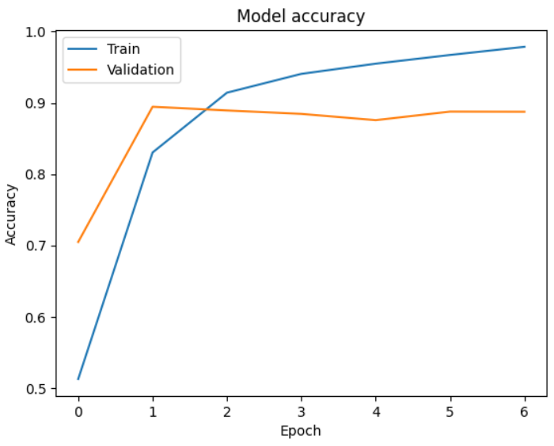
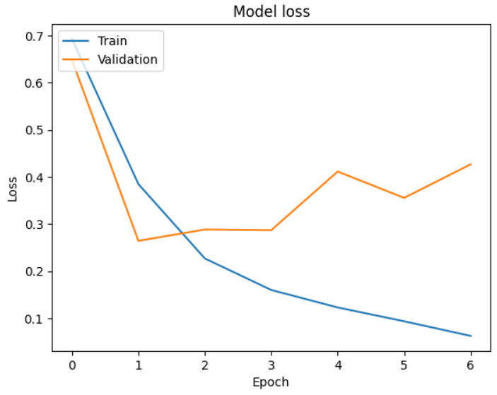
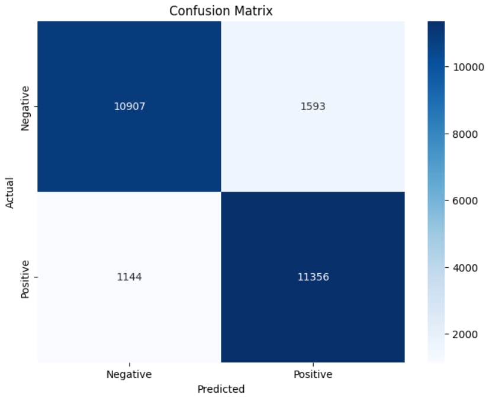

# Sentiment Analysis using Neural Networks
This project is a Sentiment Analysis Web Application that predicts the sentiment of a movie review as either 'Positive' or 'Negative'. The application is built using Streamlit for the front end, Keras for the model, and TensorFlow as the backend. The model is trained using a Convolutional Neural Network (CNN) for text classification.

## Live Demo
Check out the live demo of the application [here](https://sentiment-analysis-using-neural-networks-2qqyhg2xv7zrjncmj7tl6.streamlit.app/).

## Model Comparison
To determine the best-suited architecture for sentiment classification on the IMDb movie reviews, I compared three different architectures:
1. **Convolutional Neural Network (CNN)**
2. **Long Short-Term Memory (LSTM)**
3. **Hybrid LSTM-CNN**

After extensive evaluation, the CNN architecture was found to be the best in terms of performance and accuracy for this dataset. Therefore, the CNN model was used in the application.

## Setup Instructions
### Clone the Repository
```sh
https://github.com/areebbinnadeem/Sentiment-Analysis-using-Neural-Networks
```

### Install Dependencies
Ensure you have Python installed, then run:
```sh
pip install -r requirements.txt
```

### Add Model and Tokenizer
Ensure you have the cnn_model.h5 and tokenizer.json files in the src directory.

### Run the Application
```sh
streamlit run src/app.py
```

## Model Training
The model is trained using a Convolutional Neural Network (CNN) on a dataset of movie reviews. The key steps involved in training the model include:
1. **Data Preprocessing:** Tokenization and padding of text data.
2. **Model Architecture:** Building the CNN model.
3. **Training:** Training the model on the dataset.


## Visualizations

### Model Accuracy and Loss





### Confusion Matrix



## Acknowledgements
- **Streamlit:** For providing an easy way to create web apps.
- **TensorFlow & Keras:** For powerful tools to build and train neural networks.
- **FREEPIK:** For different emotions image.

## License
[MIT](https://choosealicense.com/licenses/mit/)

## Contributing
Contributions are welcome! Please open an issue or submit a pull request for any improvements or suggestions.

## Contact
For any questions or feedback, feel free to reach out:
* **Email:** M.AreebBinNadeem@gmail.com
* **GitHub:** areebbinnadeem
